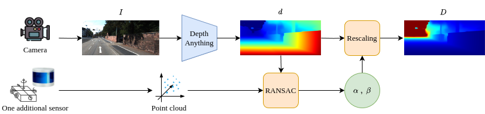

<div align="center">
<h2>Foundation Models Meet Low-Cost Sensors: Rescaling Affine-Invariant Disparity without Training for Zero-Shot Metric Depth Estimation
</h2>

**Rémi Marsal** · **Alexandre Chapoutot** · **Philippe Xu** · **David Filliat**

U2IS - ENSTA-Paris



</div>

This repository contains the official implementation of the paper *Foundation Models Meet Low-Cost Sensors: Rescaling Affine-Invariant Disparity without Training for Zero-Shot Metric Depth Estimation*.

## Installation

Download the datasets from official websites. Follow intructions [here](https://github.com/TRI-ML/dgp/blob/master/docs/VIRTUAL_ENV.md) to install the [dgp](https://github.com/TRI-ML/dgp/tree/master) library.

```
git clone https://gitlab.ensta.fr/ssh/monocular-depth-rescaling
cd monocular-depth-rescaling
pip install -r requirements.txt
cd metric_depth
```

Follow instructions to install [OmniGlue](https://github.com/google-research/omniglue).

Then, to use rescaling with structure-from-motion and [OmniGlue](https://github.com/google-research/omniglue), the matching keypoints must be extracted beforehand using:
```
python extract_omniglue_matches.py -d <kitti | ddad> --save_path /path/to/save/keypoints
```

## Evaluation

Download [Depth Anything V1](https://github.com/LiheYoung/Depth-Anything) checkpoints without fine-tuning [here](https://huggingface.co/spaces/LiheYoung/Depth-Anything/tree/main/checkpoints).

```
python evaluate.py \
-m zoedepth \
--pretrained_resource="local::/path/to/the/checkpoint.pth" \
-d <kitti | nyu | ddad | diode_outdoor | diode_indoor | sunrgbd | ibims> \
-r <lidar | stereo | sfm> \
```

Additional arguments:

- Use `--num_beams` with `-r lidar` to specify the number of beams of the LiDAR.
- Use `--matching_with <sift | omniglue>` with `-r sfm` to select the keypoints extraction and matching approach.
- Use `-t`  with `-r sfm` to specify the minimum pose translation to consider.
- Use `--path_to_keypoints /path/to/OmniGlue/keypoints`  with `--matching_with omniglue` to load OmniGlue keypoints.

## Acknowledgement

We would like to thanks the authors of [Depth Anything](https://github.com/LiheYoung/Depth-Anything) for their great work and for sharing their code.
